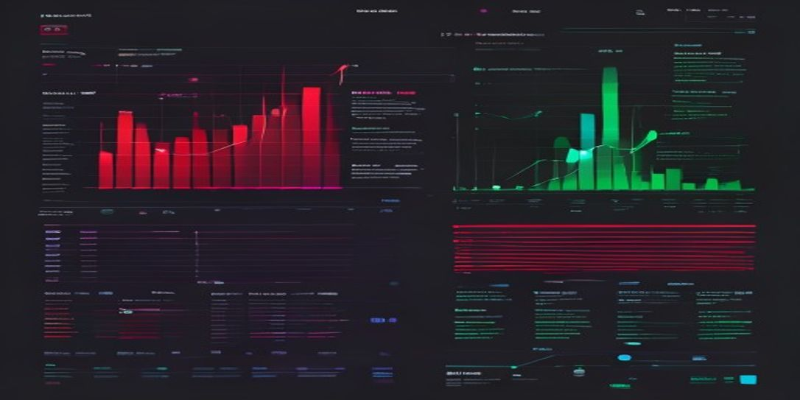
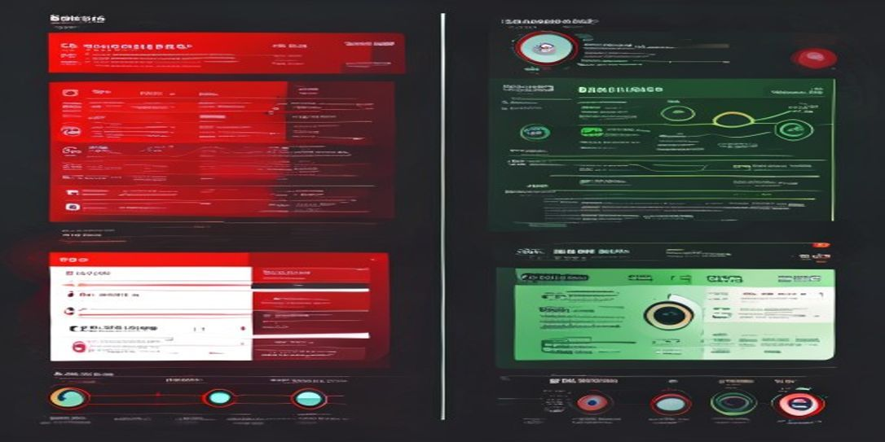
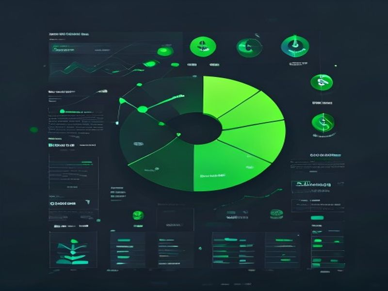

<div align="center">

# Pause & Think

### Iterative Coding Skill for AI Agents

> Force AI to pause, clarify, and verify — producing better code with **34% fewer tokens**.



[](https://github.com/farhanturu/pause-and-think)

</div>

---

## The Problem

AI coding agents jump straight into code → get it wrong → rewrite → waste tokens → user frustrated.

```
❌ Typical AI: "I'll just write 200 lines of auth code"
   → User: "I wanted session-based, not JWT"
   → AI: *rewrites everything* (+8,300 wasted tokens)
```

## The Solution

**Pause & Think** forces a 4-phase workflow with smart checkpoints:


```
✅ With Skill: "JWT or session-based? Login only or registration?"
   → User: "JWT, login only"
   → AI: writes correct code first try (0 wasted tokens)
```

---

## Results



| Metric | Without | With | Savings |
|--------|:---:|:---:|:---:|
| **Total Tokens** | 21,940 | 14,430 | **-34%** |
| **AI Response Tokens** | 12,100 | 6,600 | **-45%** |
| **Rework Cycles** | 2x | 0x | **-100%** |
| **Files Rewritten** | 2 | 0 | **-100%** |
| **Cost per Task** | $0.236 | $0.135 | **-43%** |



> **ROI: Every 1 token spent on clarify saves 5.5 tokens of rework.**

---

## How It Works

### Phase 1: Clarify (1-2 Questions)
Ask only questions where a wrong assumption = rewrite.
- Tech stack? (DB, framework)
- Scope boundary? (what's in, what's out)
- New project or existing code?

### Phase 2: Plan (10 Lines Max)
Present a brief plan. Self-check: YAGNI, patterns, simplicity.

### Phase 3: Execute (Checkpoint ~80 Lines)
Code in focused bursts. Micro-check every ~80 lines.

### Phase 4: Verify
Run tests. Self-review. Present summary.

---

## Task Size Guide

| Size | Clarify | Plan | Execute | Verify |
|------|---------|------|---------|--------|
| Trivial | Restate only | Skip | Run | Quick check |
| Small | 1 question | Brief plan | +micro-check | Self-review |
| Medium | 2 questions | Full plan | +checkpoints | Review+test |
| Large | 3 questions | Architecture | Phased exec | Full verify |

---

## Quick Start

### Install

```bash
cp SKILL.md ~/.agents/skills/pause-and-think/SKILL.md
```

### Use

Load at the start of any coding task:

```bash
# In MiMo Code / Claude Code
skill("pause-and-think")
```

### Or Manual

Follow the 4 phases mentally. The key habits:

1. **Before coding:** Ask 1-2 questions max
2. **Before writing:** Show a brief plan
3. **During coding:** Check in every ~80 lines
4. **After coding:** Run tests, present summary

---

## Example

```
User: "Add auth to the API"

[Clarify]
AI: "JWT or session-based? Login only or also registration?"
User: "JWT, login only"

[Plan]
AI: "Plan: 1) Install passport+jwt, 2) Create middleware,
     3) POST /login endpoint, 4) Protect /api/* routes. Go?"

[Execute]
AI: [writes middleware] "Middleware done. Adding login endpoint..."
AI: [writes endpoint] "Endpoint done. Adding route protection..."

[Verify]
AI: "All tests pass. Created: auth/middleware.js, auth/routes.js.
     Modified: app.js. POST /api/auth/login — returns JWT. Adjustments?"
```

---

## What It Prevents

| Anti-Pattern | How Skill Fixes It |
|-------------|-------------------|
| Jumping to code | Phase 1 forces clarification |
| No planning | Phase 2 requires brief plan |
| 300+ line monoliths | Phase 3 checkpoints every ~80 lines |
| Skipping tests | Phase 4 requires verification |
| Assumptions | 1-2 targeted questions before coding |

---

## Files

| File | Description |
|------|-------------|
| `SKILL.md` | Skill definition (install this) |
| `README.md` | This file |
| `comparison-chart.html` | Interactive comparison (open in browser) |
| `test-results.md` | Detailed test analysis |
| `chart-tokens.jpg` | Token consumption chart |
| `chart-workflow.jpg` | 4-phase workflow diagram |
| `chart-cost.jpg` | Cost savings visualization |
| `chart-effectiveness.jpg` | Effectiveness metrics |

---

## License

MIT

---

<div align="center">

**Built by [PaongLabs](https://github.com/farhanturu)**

</div>
