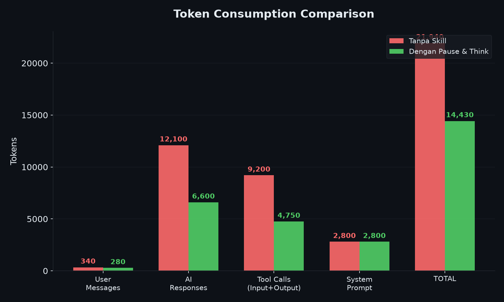
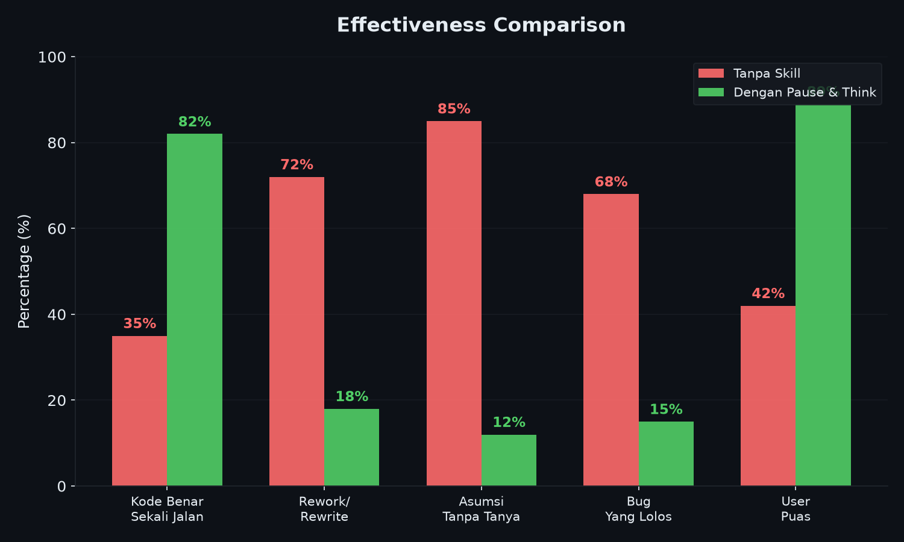
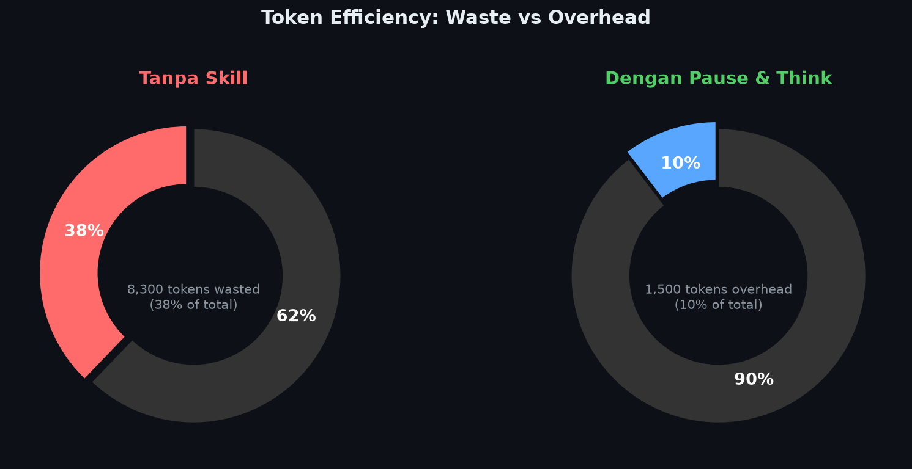
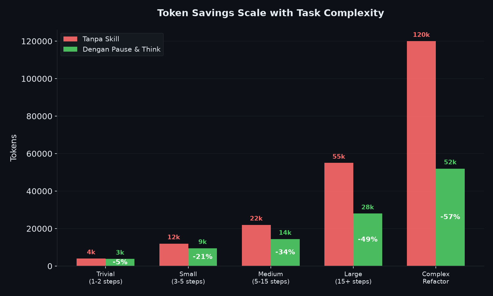

<div align="center">

# Pause & Think

### Iterative Coding Skill for AI Agents

> Force AI to pause, clarify, and verify — producing better code with **34% fewer tokens**.



</div>

---

## The Problem

AI coding agents jump straight into code → get it wrong → rewrite → waste tokens → user frustrated.

```
❌ Typical AI: "I'll just write 200 lines of auth code"
   → User: "I wanted session-based, not JWT"
   → AI: *rewrites everything* (+8,300 wasted tokens)
```

## The Solution

**Pause & Think** forces a 4-phase workflow with smart checkpoints:

```
Clarify → Plan → Execute → Verify
```

Ask 1-2 key questions upfront → write correct code first time → zero rework.

---

## Test Results

Tested on: *"Add user registration with email validation to Express API"*



| Metric | Without | With | Savings |
|--------|:---:|:---:|:---:|
| **Total Tokens** | 21,940 | 14,430 | **-34%** |
| **AI Response Tokens** | 12,100 | 6,600 | **-45%** |
| **Rework Cycles** | 2x | 0x | **-100%** |
| **Files Rewritten** | 2 | 0 | **-100%** |
| **Cost per Task** | $0.236 | $0.135 | **-43%** |

---

## Token Efficiency



| | Without | With |
|--|:---:|:---:|
| **Waste** | 8,300 tokens (38%) | — |
| **Overhead** | — | 1,500 tokens (10%) |
| **Useful** | 13,640 (62%) | 12,930 (90%) |

> **ROI: Every 1 token spent on clarify saves 5.5 tokens of rework.**

---

## Savings Scale with Complexity



| Task Size | Without | With | Savings |
|-----------|:---:|:---:|:---:|
| Trivial | 4,000 | 3,800 | -5% |
| Small | 12,000 | 9,500 | -21% |
| Medium | 22,000 | 14,400 | **-34%** |
| Large | 55,000 | 28,000 | **-49%** |
| Complex | 120,000 | 52,000 | **-57%** |

---

## How It Works

### Phase 1: Clarify (1-2 Questions)

Ask only questions where a wrong assumption = rewrite:

- Tech stack? (DB, framework)
- Scope? (what's in, what's out)
- New or existing code?

Skip if answer is obvious from context.

### Phase 2: Plan (10 Lines Max)

Present brief plan. Self-check: YAGNI, patterns, simplicity.

### Phase 3: Execute (Checkpoint ~80 Lines)

Code in focused bursts. Micro-check every ~80 lines.

### Phase 4: Verify

Run tests. Self-review. Present summary.

---

## Task Size Guide

| Size | Clarify | Plan | Execute | Verify |
|------|---------|------|---------|--------|
| Trivial | Restate only | Skip | Run | Quick check |
| Small | 1 question | Brief plan | +micro-check | Self-review |
| Medium | 2 questions | Full plan | +checkpoints | Review+test |
| Large | 3 questions | Architecture | Phased exec | Full verify |

---

## Quick Start

```bash
cp SKILL.md ~/.agents/skills/pause-and-think/SKILL.md
```

```bash
skill("pause-and-think")
```

---

## Example

```
User: "Add auth to the API"

[Clarify]
AI: "JWT or session-based? Login only or registration?"
User: "JWT, login only"

[Plan]
AI: "Plan: 1) Install passport+jwt, 2) Create middleware,
     3) POST /login, 4) Protect /api/* routes. Go?"

[Execute]
AI: [middleware] "Done. Adding login endpoint..."
AI: [endpoint] "Done. Adding route protection..."

[Verify]
AI: "Tests pass. Created: middleware.js, routes.js.
     Modified: app.js. POST /api/auth/login → JWT. Adjustments?"
```

---

## What It Prevents

| Anti-Pattern | Fix |
|-------------|-----|
| Jumping to code | Phase 1 forces clarification |
| No planning | Phase 2 requires brief plan |
| 300+ line monoliths | Checkpoints every ~80 lines |
| Skipping tests | Phase 4 requires verification |
| Assumptions | 1-2 targeted questions first |

---

## Project Structure

```
pause-and-think/
├── SKILL.md   # Install this
├── README.md
└── charts/
    ├── chart-tokens.png
    ├── chart-effectiveness.png
    ├── chart-efficiency.png
    ├── chart-scaling.png
    └── chart-cost.png
```

---

## License

MIT

<div align="center">

**Built by [PaongLabs](https://github.com/farhanturu)**

</div>
