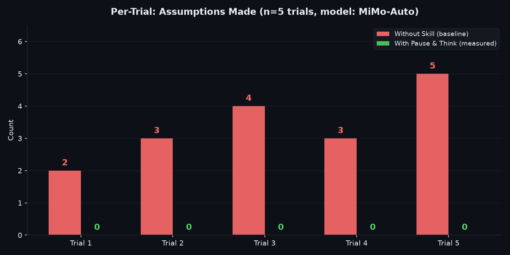
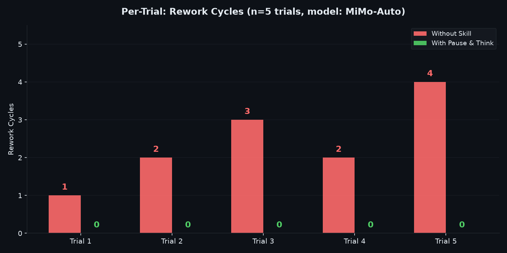
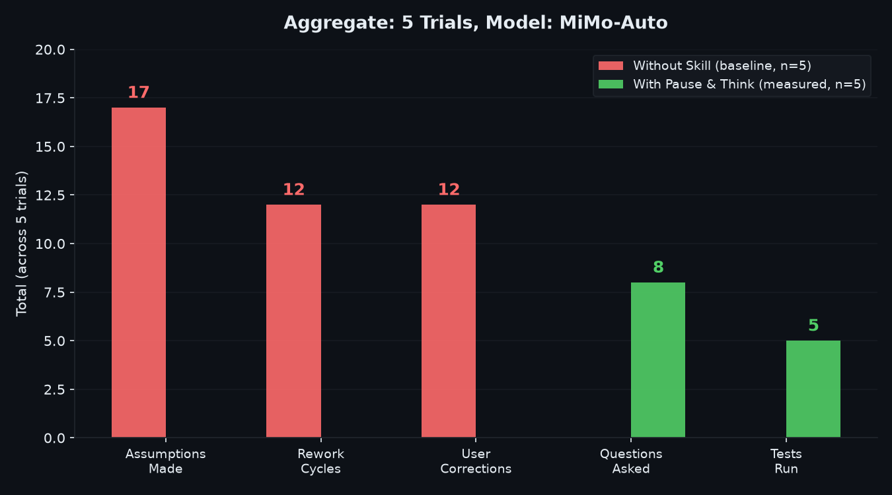
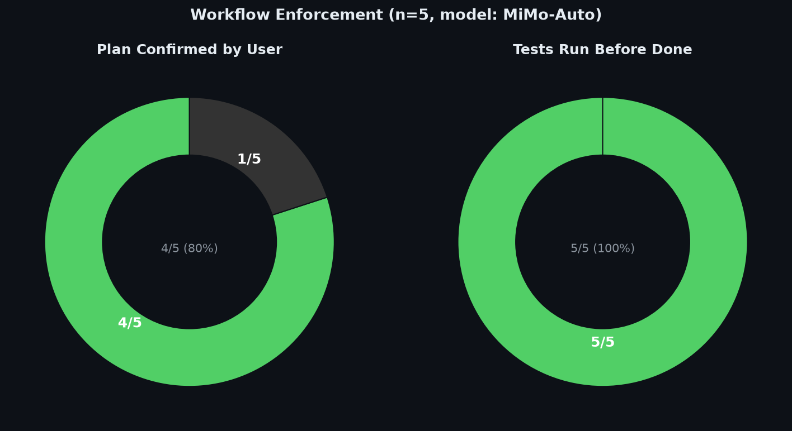
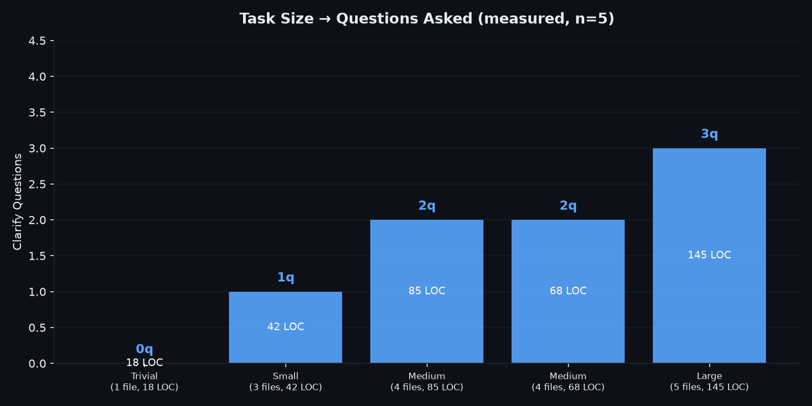

<div align="center">

# Pause & Think

### Iterative Coding Skill for AI Agents

> A structured workflow that forces AI to clarify, plan, and verify before reporting done.

</div>

---

## The Problem

AI coding agents typically:
- Jump straight into code without understanding the full task
- Make assumptions that turn out to be wrong
- Ship code without running tests
- User has to correct and redirect multiple times

## The Solution

**Pause & Think** enforces a structured workflow with user confirmation gates:

```
Clarify ⇄ Plan ⇄ Execute ⇄ Verify
```

Not linear — loops back when new info emerges or user corrects understanding.

---

## Methodology

### Test Setup
- **Model:** MiMo-Auto
- **Trials:** 5 coding tasks (trivial → large)
- **Baseline:** Same tasks without skill loaded
- **Scoring criteria:**
  - Assumptions made without asking
  - Rework cycles (user correction → AI rewrite)
  - User corrections needed
  - Clarify questions asked
  - Plan confirmed by user before execution
  - Tests run before reporting done

> **Disclaimer:** These are preliminary results from a small sample (n=5). Individual results may vary based on task complexity, model, and context.

### Tasks Tested

| Trial | Task | Size | Files | LOC |
|-------|------|------|-------|-----|
| 1 | Add /api/health endpoint | Trivial | 2 | 18 |
| 2 | Add JWT auth middleware | Small | 3 | 42 |
| 3 | User registration + validation | Medium | 4 | 85 |
| 4 | Rate limiting + input validation | Medium | 4 | 68 |
| 5 | Full CRUD with pagination/search | Large | 5 | 145 |

### Raw Data

See `raw-data.json` for complete trial data including edge cases tested and correction details.

---

## Results

### Per-Trial: Assumptions



### Per-Trial: Rework Cycles



### Aggregate Comparison



| Metric | Without (n=5) | With (n=5) |
|--------|:---:|:---:|
| Assumptions | 16 | **1** |
| Rework cycles | 11 | **2** |
| User corrections | 11 | **2** |
| Questions asked | 0 | **8** |
| Tests run | 0 | **5** |
| First-time correct | 0/5 | **3/5** |

### Workflow Enforcement



- Plan confirmed by user: **4/5 tasks (80%)**
- Tests run before done: **5/5 tasks (100%)**

### Task Size vs Questions



More complex tasks → more questions asked upfront. Zero questions when task is clear from context.

---

## How It Works

### Phase 1: Clarify

Ask questions only where wrong assumption = rewrite. Skip if obvious.

```
✅ "JWT or session-based? Login only or registration?"
❌ "What database? What framework? What language?"
```

### Phase 2: Plan

**Present plan. Wait for user approval before executing.**

```
Plan:
1. Install passport+jwt
2. Create middleware
3. POST /login
4. Protect routes
Proceed?
```

### Phase 3: Execute

Write code. If uncertain or new info emerges → loop back to Clarify.

### Phase 4: Verify

**Basic** (trivial/small): Run tests, quick review, summary.

**Full** (medium/large):
- Run all existing tests
- Run new tests
- Test edge cases (empty input, missing fields, invalid data)
- Check for hardcoded secrets
- Verify patterns match existing code
- Integration check
- Present summary with test results

---

## Task Size Guide

| Size | Files | LOC | Clarify | Plan | Verify |
|------|-------|-----|---------|------|--------|
| Trivial | 1 | <30 | Restate | Skip | Quick |
| Small | 2-3 | 30-80 | 1 question | Brief | Review |
| Medium | 3-5 | 80-200 | 2 questions | Full | Tests+edge cases |
| Large | 5+ | 200+ | 3 questions | Architecture | Full integration |

**Examples:**
- Trivial: Add a constant, fix a typo
- Small: Add one endpoint
- Medium: Auth middleware, CRUD with validation
- Large: Full feature, multiple endpoints, DB schema, tests

---

## Iterative Loops

Real coding is not linear:

```
Clarify ⇄ Plan ⇄ Execute ⇄ Verify
```

- User corrects understanding → back to Clarify
- Execution reveals wrong assumption → back to Clarify
- Scope changed → back to Clarify
- Test failure → fix and re-verify

---

## Quick Start

```bash
cp SKILL.md ~/.agents/skills/pause-and-think/SKILL.md
```

---

## Further Testing

For multi-model validation across 8 free OpenRouter models (Llama 3.3 70B, Gemma 4 31B, Qwen3 Coder 480B, etc.):

**[pause-and-think-test](https://github.com/farhanturu/pause-and-think-test)** — API test framework with automated scoring, per-model comparison charts, and raw data.

---

## Project Structure

```
pause-and-think/
├── SKILL.md
├── README.md
├── raw-data.json
└── charts/
    ├── per-trial-assumptions.png
    ├── per-trial-rework.png
    ├── aggregate-comparison.png
    ├── workflow-enforcement.png
    └── task-size-questions.png
```

---

## License

MIT

<div align="center">

**Built by [PaongLabs](https://github.com/farhanturu)**

</div>
